# Sleep Health and Lifestyle Analysis

Ten projekt analizuje dane dotyczące snu, stylu życia i wybranych wskaźników zdrowotnych.

## Cel projektu

Celem było sprawdzenie, które czynniki mogą być powiązane z jakością snu i występowaniem zaburzeń snu.

Projekt zawiera:
- czyszczenie danych,
- analizę eksploracyjną,
- wizualizacje,
- analizę korelacji,
- prosty model uczenia maszynowego.

## Dane

Zbiór danych zawiera 374 obserwacje i 13 zmiennych.

W danych znajdują się informacje takie jak:

- płeć,
- wiek,
- zawód,
- długość snu,
- jakość snu,
- poziom aktywności fizycznej,
- poziom stresu,
- kategoria BMI,
- ciśnienie krwi,
- tętno,
- dzienna liczba kroków,
- zaburzenie snu.

Brakujące wartości w kolumnie `sleep_disorder` potraktowałam jako brak zgłoszonego zaburzenia snu.

## Narzędzia

- Python
- pandas
- matplotlib
- seaborn
- scikit-learn

## Etapy analizy

- Wczytanie danych
- Uporządkowanie nazw kolumn
- Obsługa brakujących wartości
- Utworzenie dodatkowych zmiennych
- Analiza jakości i długości snu
- Analiza poziomu stresu, BMI i aktywności fizycznej
- Przygotowanie wykresów
- Sprawdzenie korelacji między zmiennymi
- Zbudowanie prostych modeli klasyfikacyjnych

## Najważniejsze wnioski

- Osoby bez zgłoszonych zaburzeń snu miały najwyższą średnią jakość snu.
- Osoby z bezsennością miały najniższą średnią jakość snu.
- Osoby z bezsennością spały średnio krócej niż pozostałe grupy.
- Wyższy poziom stresu był powiązany z niższą jakością snu.
- Długość snu była silnie dodatnio powiązana z jakością snu.
- Model regresji logistycznej osiągnął najlepszy wynik klasyfikacji.
- Accuracy najlepszego modelu wyniosło około 90%.

## Wizualizacje

### Rozkład jakości snu

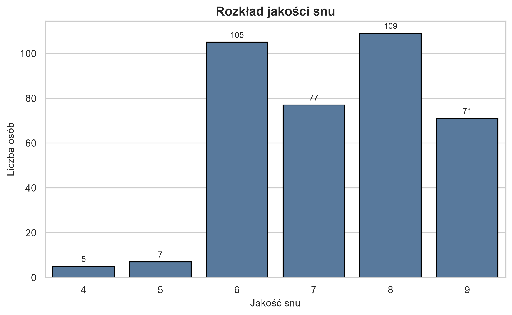

### Długość snu a jakość snu

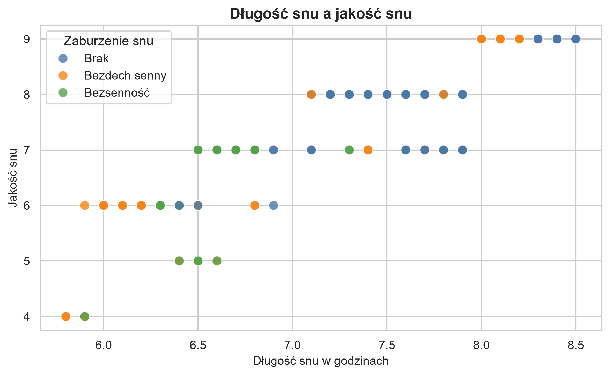

### Poziom stresu a jakość snu

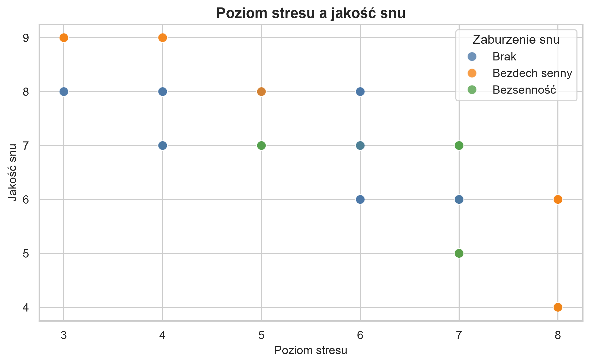

### Jakość snu według kategorii BMI

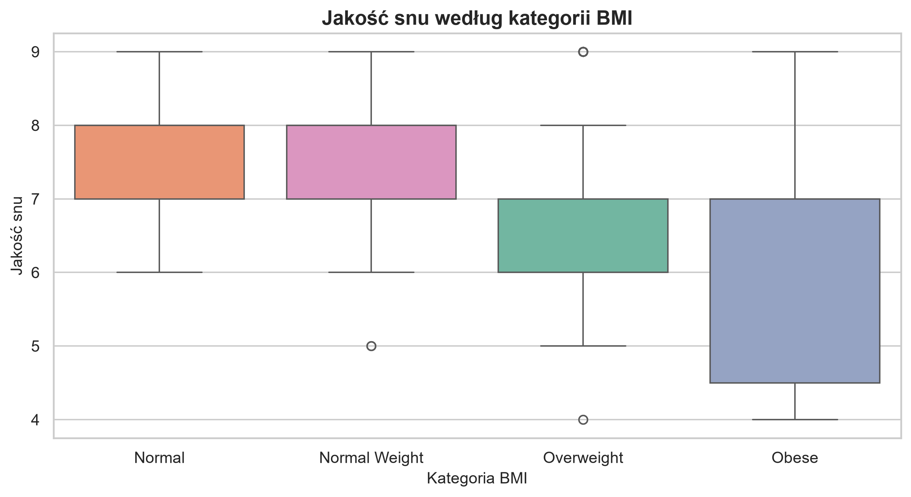

### Aktywność fizyczna a jakość snu

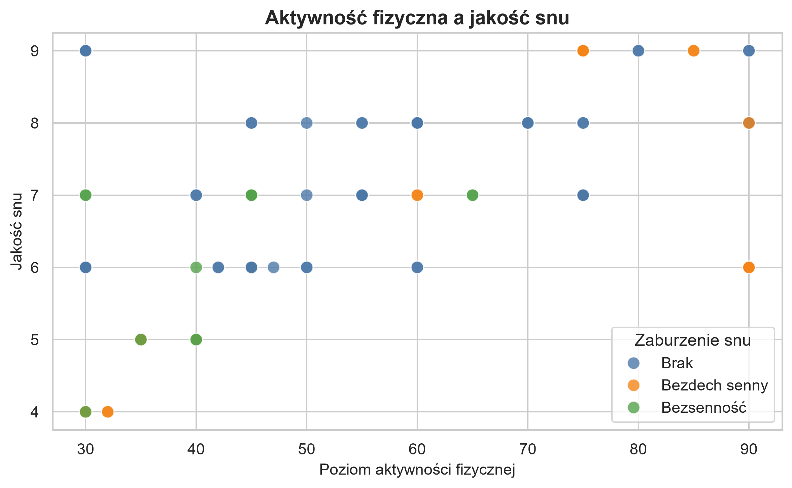

### Macierz korelacji

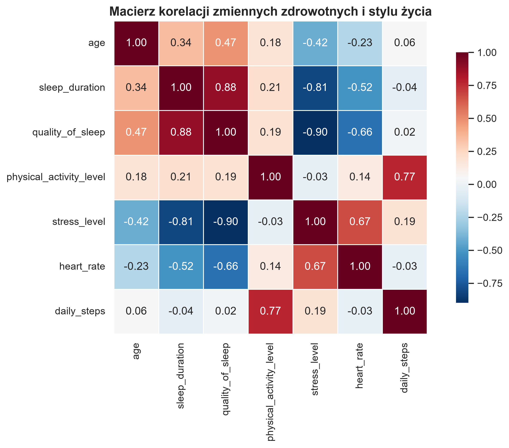

### Rozkład zaburzeń snu

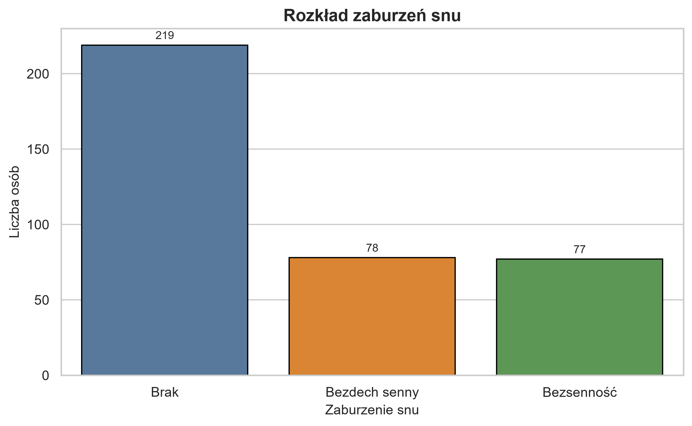

### Zaburzenia snu według kategorii BMI

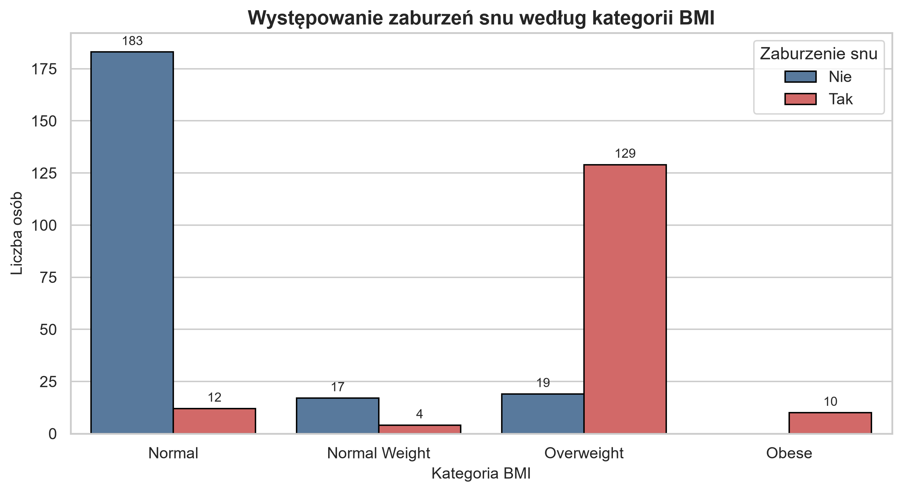

### Jakość snu według zawodu

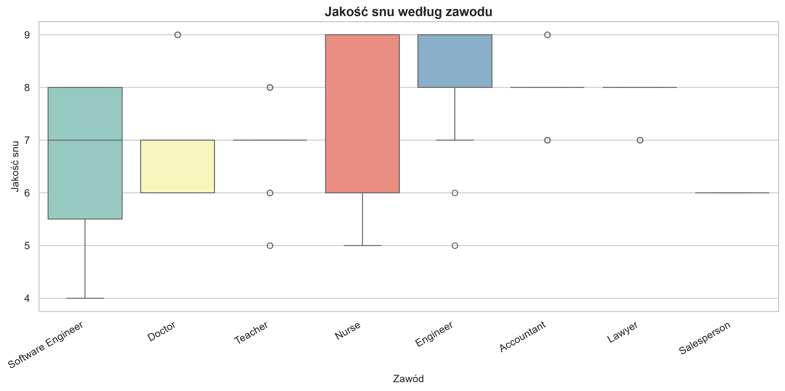

### Poziom stresu według zawodu

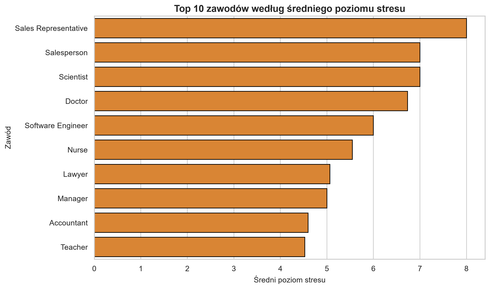

### Tętno a poziom stresu

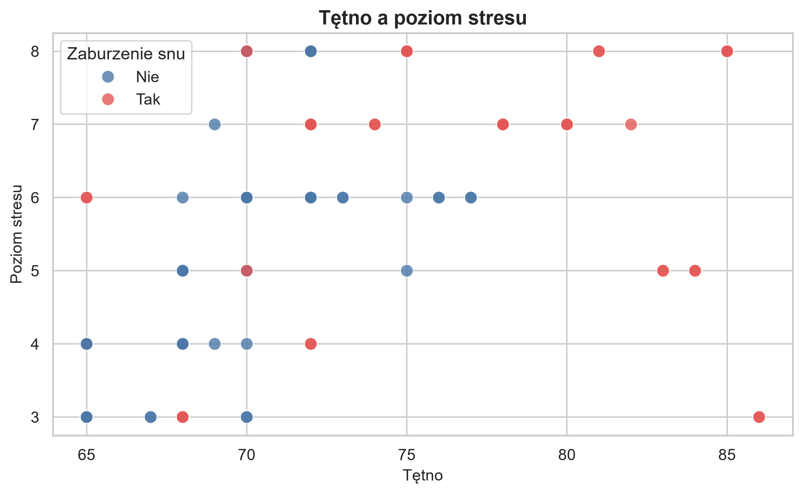

### Macierz pomyłek — regresja logistyczna

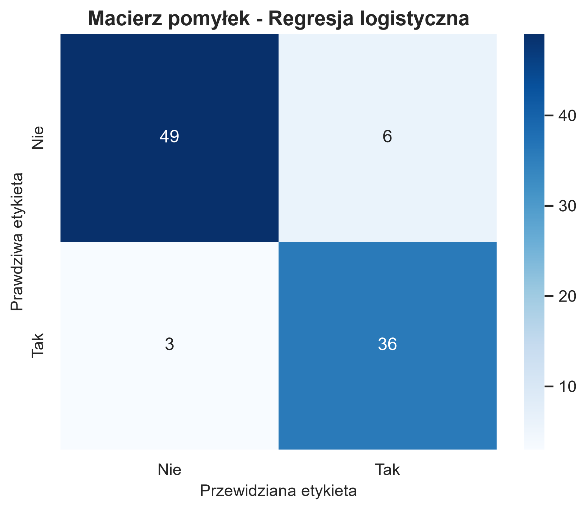

### Macierz pomyłek — Random Forest

### Najważniejsze cechy w modelu Random Forest

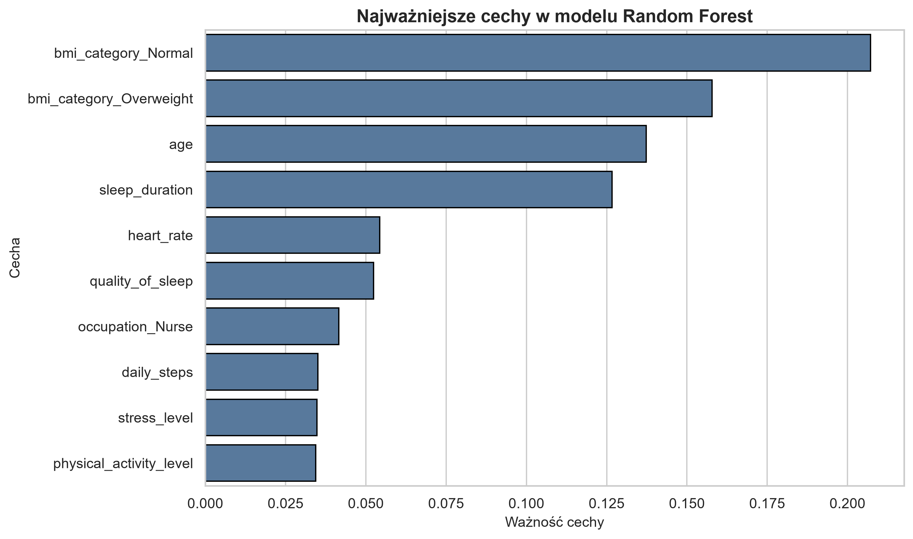

## Model uczenia maszynowego

W projekcie zbudowałam dwa proste modele klasyfikacyjne:

- regresję logistyczną,
- Random Forest.

Celem modelu było przewidzenie, czy dana osoba ma zgłoszone zaburzenie snu.

Najlepszy wynik uzyskała regresja logistyczna.  
Model osiągnął accuracy na poziomie około 90%.

