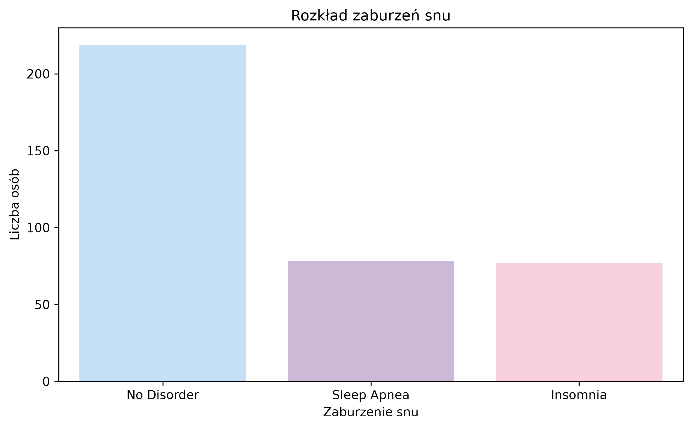
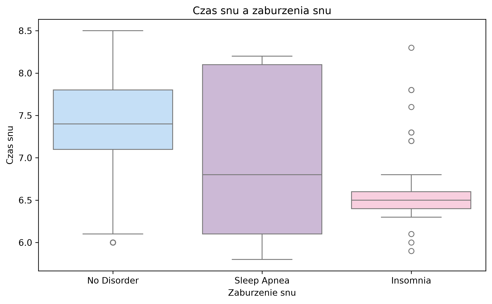
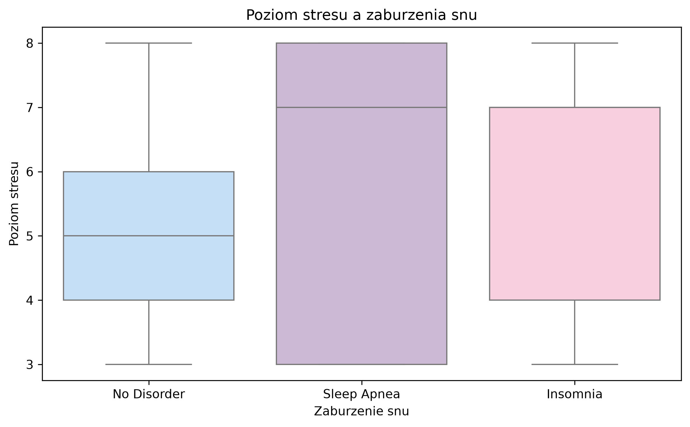
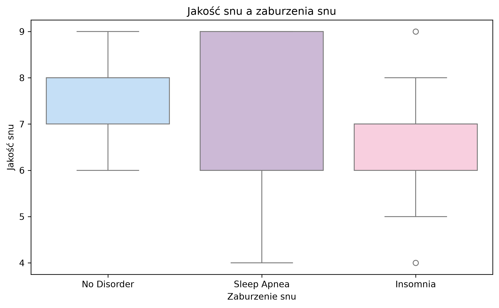
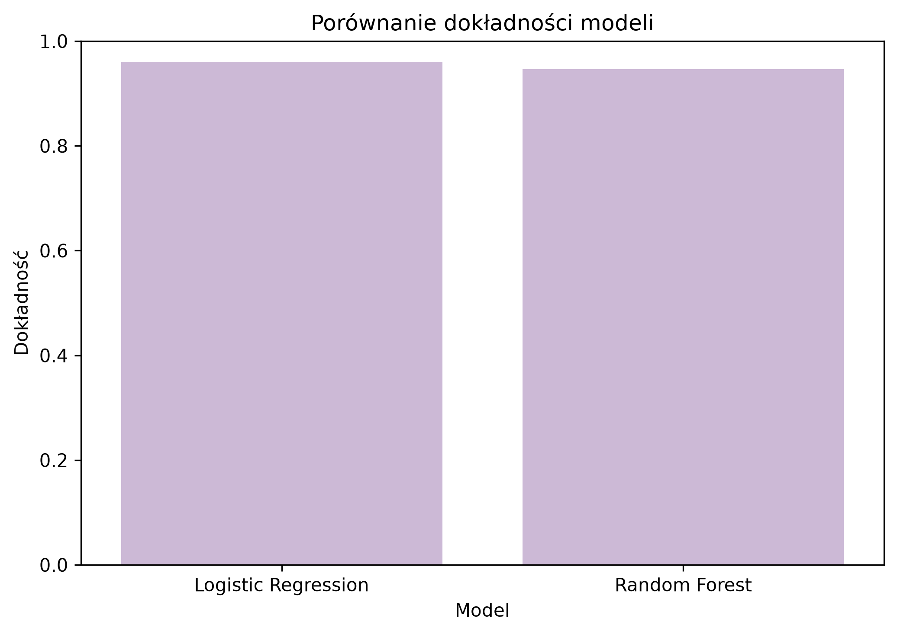
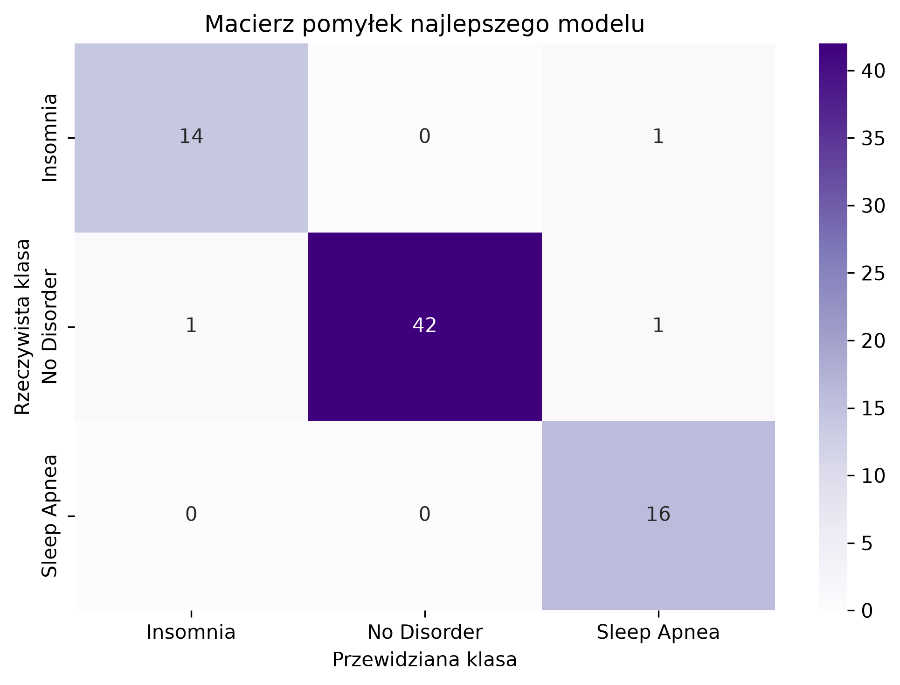
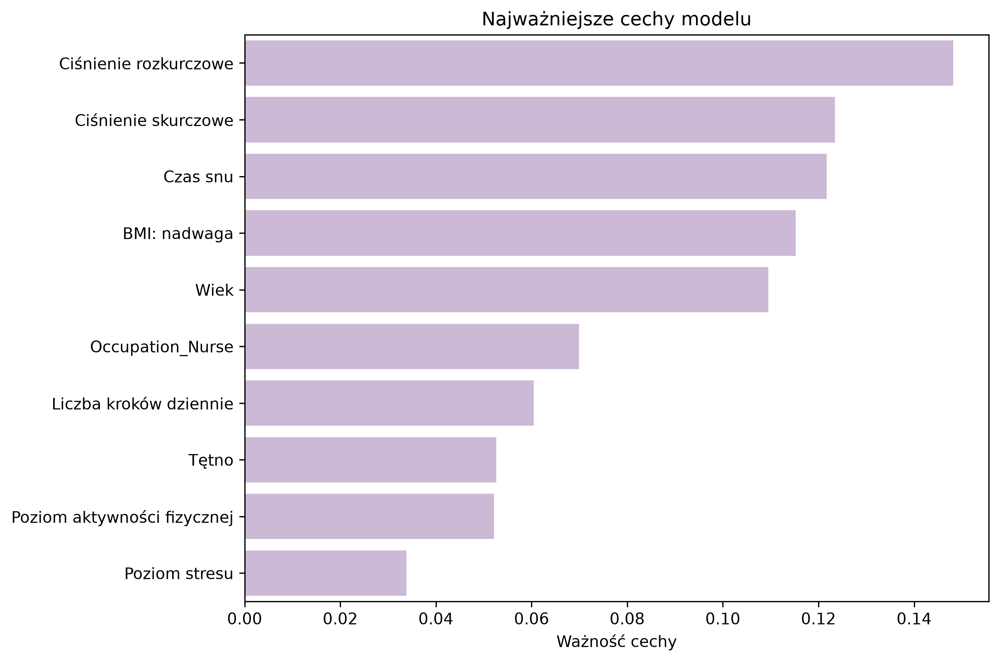

# Sleep Health Lifestyle Analysis

## Opis projektu

Celem projektu jest analiza danych dotyczących snu, stylu życia i zdrowia oraz zbudowanie modelu przewidującego występowanie zaburzeń snu.

W projekcie sprawdzam, jak takie cechy jak czas snu, jakość snu, poziom stresu, aktywność fizyczna, ciśnienie krwi, tętno, BMI i liczba kroków dziennie wiążą się z zaburzeniami snu.

Zmienną przewidywaną jest `Sleep_Disorder`, czyli informacja o tym, czy dana osoba ma zaburzenie snu.

## Zbiór danych

Dane pochodzą ze zbioru **Sleep Health and Lifestyle**.

Zbiór danych zawierał początkowo:

- 374 obserwacje,
- 13 kolumn,
- informacje o śnie, stylu życia i podstawowych cechach zdrowotnych.

Najważniejsze kolumny wykorzystane w projekcie:

- `Gender`
- `Age`
- `Occupation`
- `Sleep Duration`
- `Quality of Sleep`
- `Physical Activity Level`
- `Stress Level`
- `BMI Category`
- `Blood Pressure`
- `Heart Rate`
- `Daily Steps`
- `Sleep Disorder`

## Cel analizy

Celem projektu było:

- przygotowanie i oczyszczenie danych,
- sprawdzenie rozkładu zaburzeń snu,
- analiza zależności między snem, stresem i stylem życia,
- przygotowanie danych do modelowania,
- porównanie dwóch modeli klasyfikacyjnych,
- sprawdzenie najważniejszych cech dla modelu

## Użyte technologie

W projekcie wykorzystałam:

- Python,
- pandas,
- numpy,
- matplotlib,
- seaborn,
- scikit-learn,
- joblib.

## Struktura projektu

- `src/` – pliki z kodem,
- `images/` – wybrane wykresy,
- `README.md` – opis projektu,
- `requirements.txt` – lista bibliotek,

## Przygotowanie danych

W pierwszym kroku dane zostały wczytane i sprawdzone pod kątem brakujących wartości oraz duplikatów.

Braki danych występowały tylko w kolumnie `Sleep Disorder`. Brak wartości w tej kolumnie został potraktowany jako brak zaburzenia snu i zastąpiony wartością `No Disorder`.

Kolumna `Blood Pressure` została podzielona na dwie osobne kolumny:

- `Systolic_BP`
- `Diastolic_BP`

Usunięta została kolumna `Person ID`, ponieważ była tylko identyfikatorem osoby i nie wnosiła informacji do modelu.

Po czyszczeniu danych zostało:

- 374 obserwacje,
- 13 kolumn,
- 0 brakujących wartości.

## Eksploracyjna analiza danych

W analizie sprawdziłam m.in.:

- rozkład zaburzeń snu,
- zależność między czasem snu a zaburzeniami snu,
- zależność między poziomem stresu a zaburzeniami snu,
- zależność między jakością snu a zaburzeniami snu.

### Rozkład zaburzeń snu

W zbiorze danych najwięcej osób nie miało zaburzeń snu.

Rozkład zmiennej `Sleep_Disorder` po czyszczeniu:

| Zaburzenie snu | Liczba osób |
|---|---:|
| No Disorder | 219 |
| Sleep Apnea | 78 |
| Insomnia | 77 |

### Czas snu a zaburzenia snu

### Poziom stresu a zaburzenia snu

### Jakość snu a zaburzenia snu

## Modelowanie

Do przewidywania zaburzeń snu wykorzystałam dwa modele klasyfikacyjne:

- regresję logistyczną,
- las losowy.

Zmienną przewidywaną była kolumna:

- `Sleep_Disorder`

Modele przewidywały jedną z trzech klas:

- `No Disorder`
- `Sleep Apnea`
- `Insomnia`

Dane zostały podzielone na zbiór treningowy i testowy w proporcji 80/20.

## Wyniki modeli

| Model | Dokładność |
|---|---:|
| Regresja logistyczna | 0.9200 |
| Las losowy | 0.9467 |

Najlepszy wynik uzyskał model **lasu losowego**.

### Porównanie dokładności modeli

### Macierz pomyłek

## Najważniejsze cechy modelu

Dla modelu lasu losowego sprawdziłam ważność cech.

Najważniejsze cechy to:

- `Diastolic_BP`
- `Systolic_BP`
- `Sleep_Duration`
- `BMI_Category_Overweight`
- `Age`
- `Occupation_Nurse`
- `Daily_Steps`
- `Heart_Rate`
- `Physical_Activity_Level`
- `Stress_Level`

Oznacza to, że model najmocniej korzystał z informacji o ciśnieniu krwi, czasie snu, BMI, wieku i wybranych cechach stylu życia.

## Wnioski

Na podstawie analizy można zauważyć, że:

- osoby z zaburzeniami snu różniły się pod względem czasu snu i jakości snu,
- poziom stresu był ważną cechą w analizie zaburzeń snu,
- cechy zdrowotne, takie jak ciśnienie krwi, tętno i BMI, miały znaczenie dla modelu,
- las losowy uzyskał lepszy wynik niż regresja logistyczna,
- najlepszy model osiągnął dokładność około 94.7%.

W danych nie ma wielu czynników, które mogłyby wpływać na sen, np. historii chorób, leków, diety, pracy zmianowej czy szczegółowych informacji o stylu życia.

